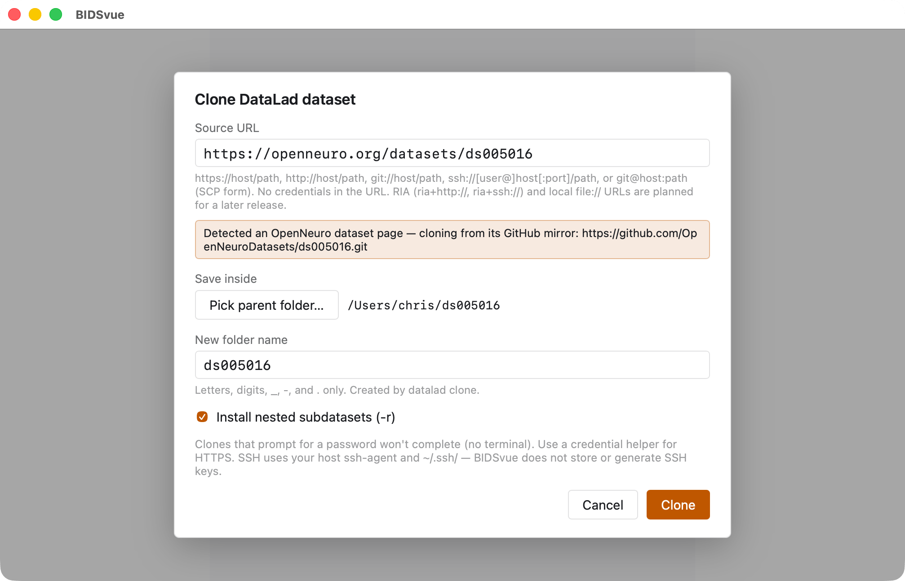
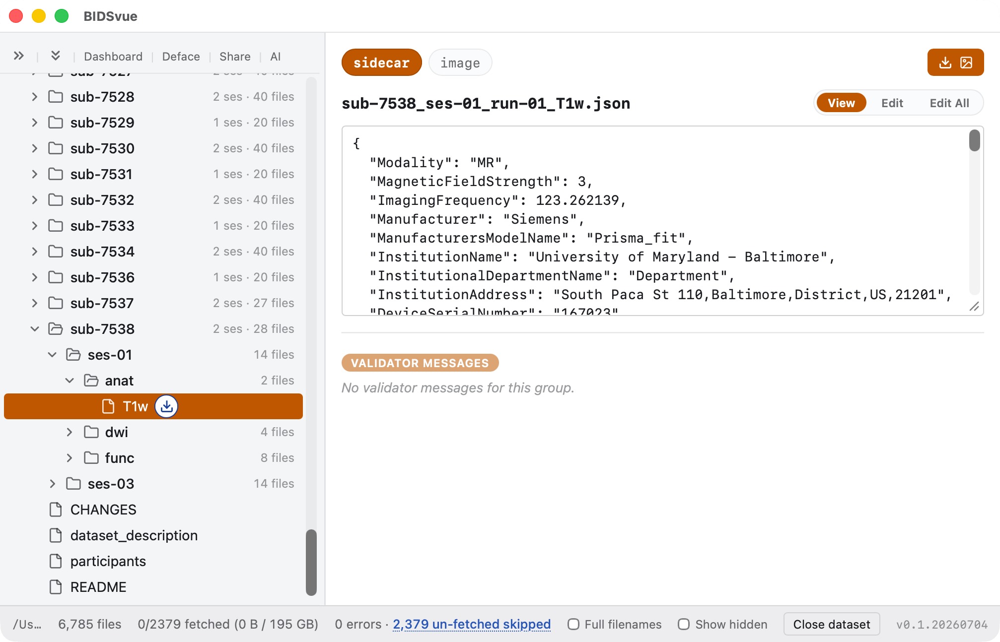
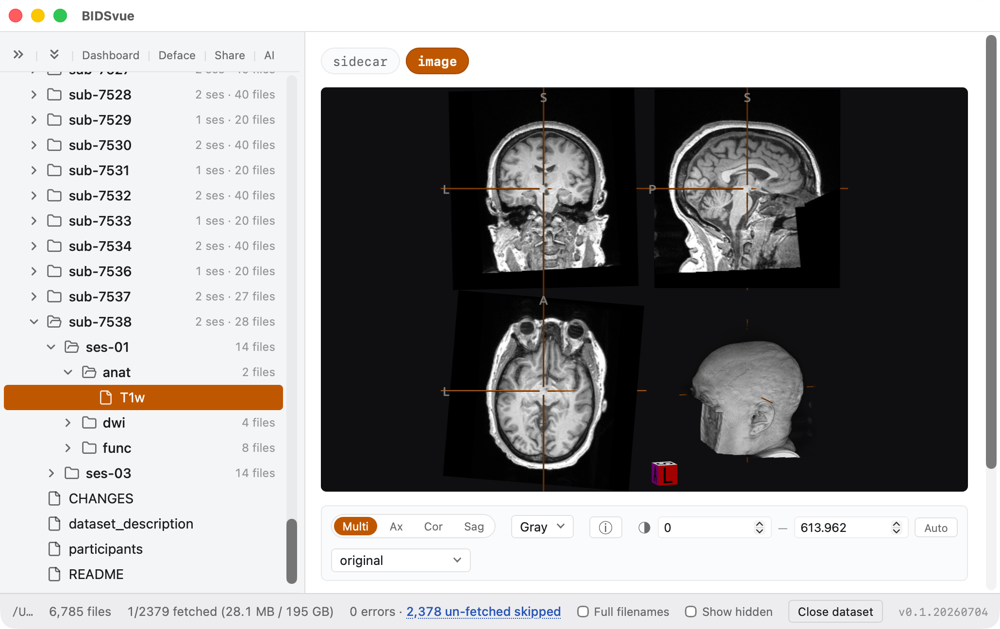
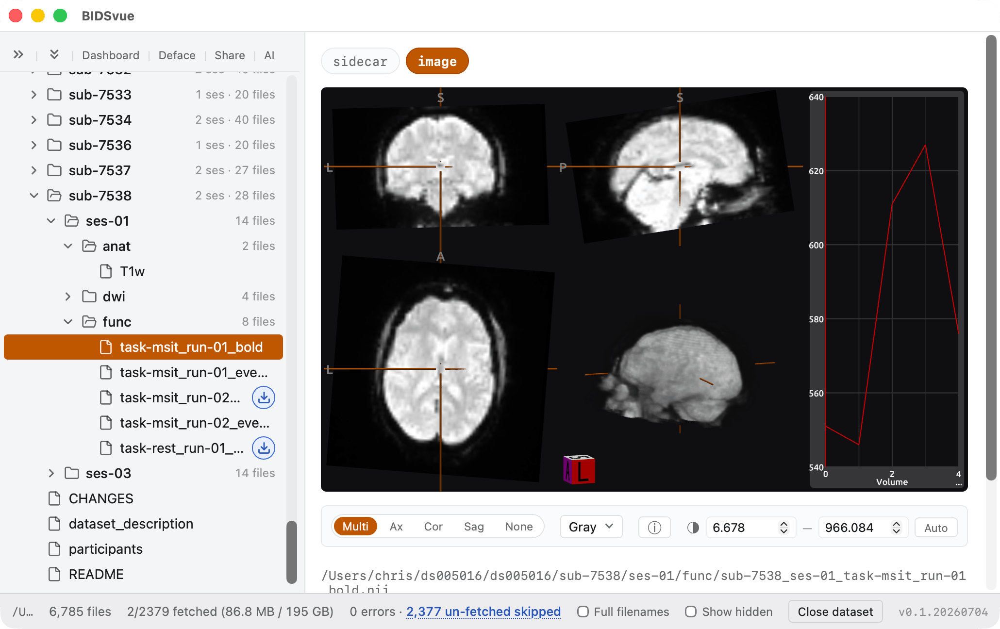
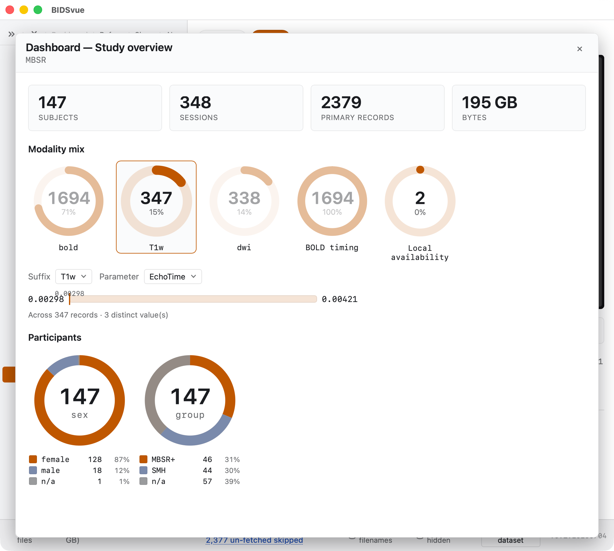

# Working with DataLad datasets

[DataLad](https://www.datalad.org) manages files as a Git / git-annex
repository. That lets you track the exact history of your imaging data, share the
dataset's structure as lightweight text files, and retrieve massive imaging
files from the cloud only when you actually need them. This tutorial shows how to
inspect a huge DataLad dataset without downloading all of it.

## Requirements

- Install [BIDSvue](https://github.com/niivue/BIDSvue/releases) for Linux, macOS, or Windows.
- Roughly 15 minutes and a little free disk space.

> [!TIP]
> DataLad repositories can hold a huge number of gigantic files. By default,
> BIDSvue downloads only the small ones (the text sidecars and tables). If you
> choose to fetch the whole dataset, make sure you have the disk space for it.

## 1. Clone a DataLad dataset

Launch BIDSvue and choose **Clone DataLad dataset**.

- For the **Source URL**, paste an OpenNeuro dataset such as [ds005016](https://openneuro.org/datasets/ds005016).
- For **Save inside**, pick a location with enough space and write permission.
- Optionally, choose to install nested datasets.
- Give the dataset a memorable name.
- Press **Clone** to fetch the dataset.

## 2. Inspect the dataset

BIDSvue opens into the dataset view. The left tree lists every file; click a node
to preview it. The status bar reports 6785 files, of which 2379 are unfetched. We
could click the unfetched button to download them all, but that would take a long
time and consume a lot of disk space.

When we select an image — say `sub-7538_ses-01_run-01_T1w` — a blue download icon
appears next to its name in the tree. We can still view the small sidecar, but the
image itself isn't available locally yet.

## 3. View an anatomical image

Click the download icon for `sub-7538_ses-01_run-01_T1w` and the file is fetched.

- We can now inspect the image and see that the face has been removed from this scan.

## 4. View a functional image

Click the download icon for `sub-7538_ses-01_task-msit_run-01_bold` and the fMRI
timeseries is fetched.

- We can now inspect the image, including a timeline that shows how the signal changes over time. Click anywhere on the graph to jump to different 3D volumes in the 4D series. The graph's bottom-right ellipsis (`…`) loads the entire time series — so you can take a quick first look and defer loading the full series until you need it.

## 5. Generate a dashboard

Press the **Dashboard** button at the top of the tree view for a rapid overview of
the whole dataset. The dashboard is a great way to spot anomalies or get a sense
of the demographics.

- For the study `ds005016`, one participant has the sex `n/a` — this might warrant an audit.
- You can also drill down into the data. Select the suffix `T1w` and the parameter `EchoTime`, and we see the echo time ranges from 2.98 ms to 4.21 ms across three distinct values. The mode (347 of them) is 2.98 ms, so the outliers may be worth a look.

