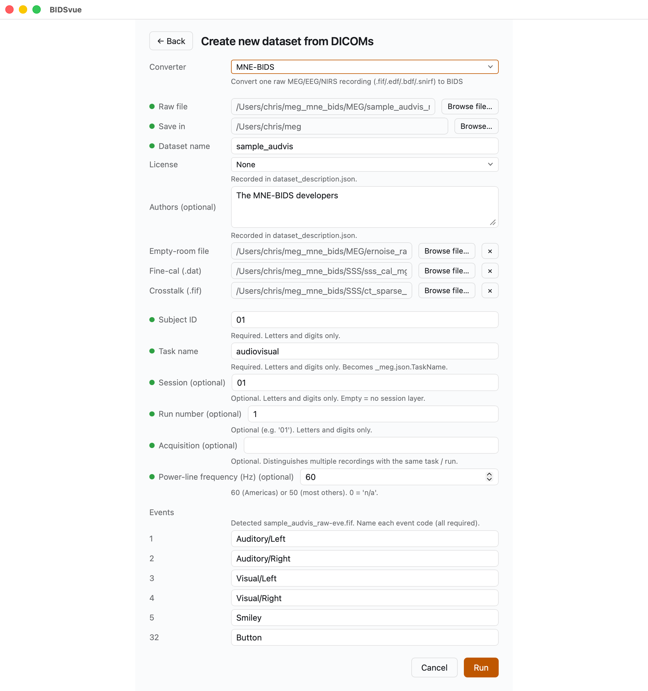
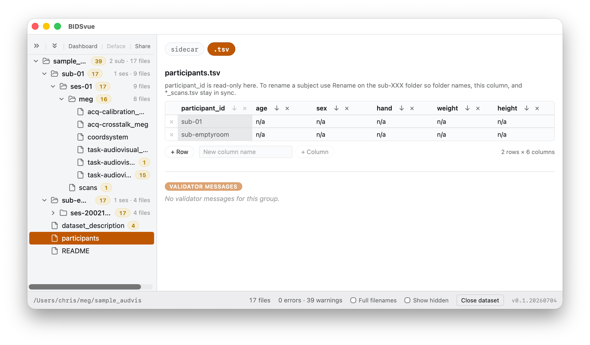
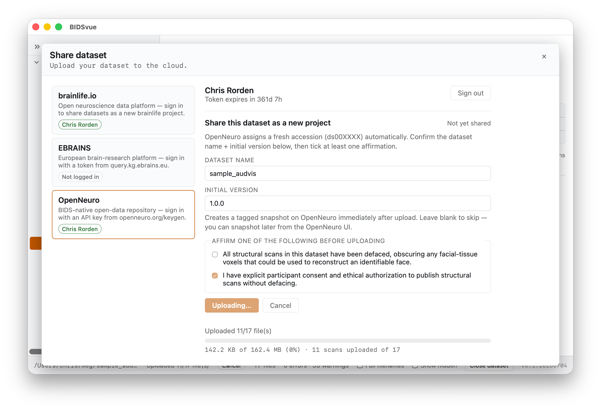

# Convert MEG to BIDS using MNE-BIDS

This walkthrough converts Elekta Neuromag MEG data into a validated, shareable
BIDS dataset. The data and instructions come from the
[MNE-BIDS developers](https://mne.tools/mne-bids/stable/auto_examples/convert_mne_sample.html) —
BIDSvue provides a graphical wrapper for their tool.

## Requirements

- Install [BIDSvue](https://github.com/niivue/BIDSvue/releases) for Linux, macOS, or Windows.
- Download and extract the sample [`meg_mne_bids` dataset](https://osf.io/v5ahf/?action=download) (a single subject, single session).
- Install [MNE-BIDS](https://mne.tools/mne-bids/stable/install.html) into your Python environment.
- Launch BIDSvue from that Python environment. If the environment can't reach MNE-BIDS, the plug-in appears grayed out in the converter selection.
- Roughly 15 minutes and a little free disk space.

> [!TIP]
> The original dataset encodes events as numbers. BIDSvue detects the distinct
> events for you, but you'll still want to give each a meaningful name.

## 1. Create a new dataset from MEG

Launch BIDSvue and choose **Create new dataset from DICOM**, then select the
`MNE-BIDS` converter.

- Fill in every item with a red dot next to its name; once they all turn green, you can press **Run**.
- For **Raw file**, choose the recording `sample_audvis_raw.fif` from the extracted `meg_mne_bids` folder.
- For **Save in**, pick a location with enough space and write permission.
- You can optionally supply an empty-room (`ernoise`), fine-calibration (`sss_cal`), and crosstalk (`ct`) file.
- Supply a subject ID and a task name.
- BIDSvue detected six different events, so give each a meaningful name — here `Auditory/Left`, `Auditory/Right`, `Visual/Left`, `Visual/Right`, `Smiley`, and `Button`.
- Once all required elements are set, the **Run** button lights up. Press **Run** to convert the dataset.

## 2. Inspect the elements

BIDSvue opens straight into the dataset view. The left tree lists every file;
click a node to preview it, and watch the status bar confirm the bids-validator
found no errors.

This is the moment to record properties the source file doesn't carry. If you
open the `participants.tsv` file, you'll see the subject's age, sex, and other
details are missing. Once you make a change, a **Save** button lets you record it.

## 3. Share your dataset

Once you're satisfied the data is anonymized and correctly curated, publish it.
Press **Share** above the tree and pick a provider — here, OpenNeuro.

- The first time you share with a repository, you'll be asked for an access
  token; the link provided walks you to it, and BIDSvue remembers it for you.
- The provider may ask you to confirm the data is de-identified before the
  upload begins. You'll then see your files' progress as they upload.

