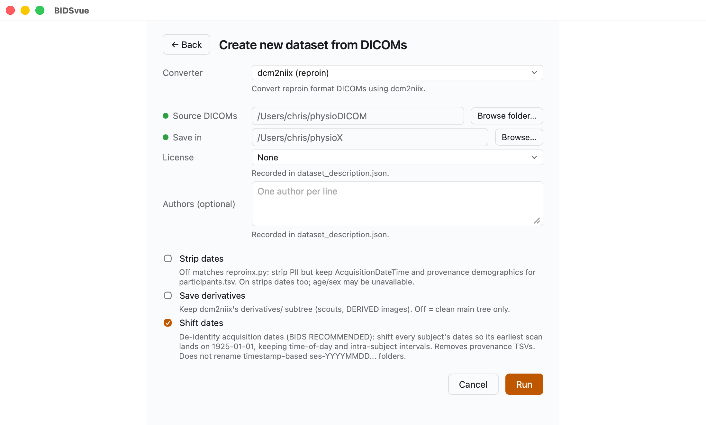
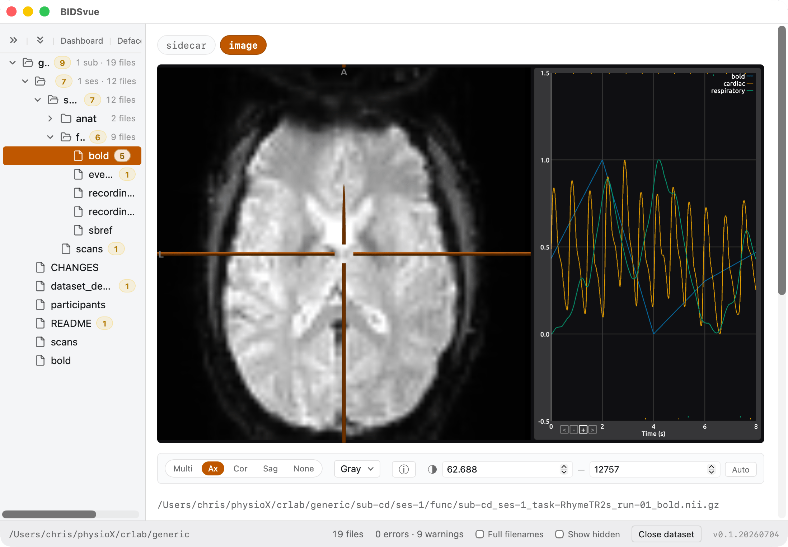
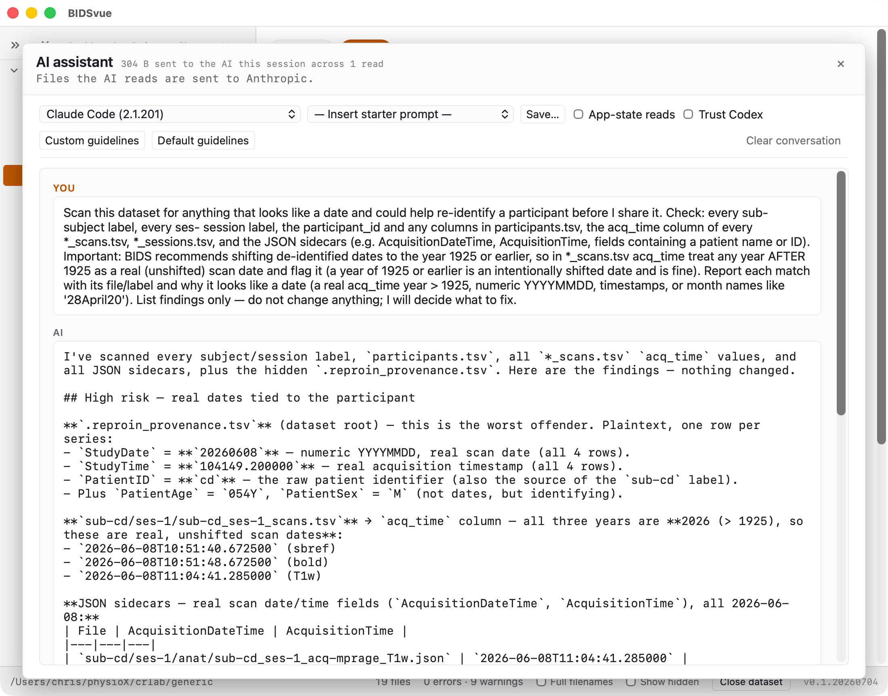

# Convert MRI with physiological recordings to BIDS

The BIDS standard supports
[physiological recordings](https://bids-specification.readthedocs.io/en/stable/modality-specific-files/physiological-recordings.html).
Modern Siemens scanners can derive a respiration signal from vibrations in the
scanner bed — so the participant doesn't need a respiration belt — and even the
product sequences can
[save physiological measures directly as DICOM images](https://github.com/neurolabusc/dcm_qa_physio).
This tutorial converts an MRI dataset with paired respiratory and pulse data from
DICOM into a BIDS dataset.

## Requirements

- Install [BIDSvue](https://github.com/niivue/BIDSvue/releases) for Linux, macOS, or Windows.
- Download and extract the sample [`physioDICOM` dataset](https://osf.io/hcrsv/?action=download) (a single subject, single session).
- Roughly 15 minutes and a little free disk space.

> [!TIP]
> BIDSvue's built-in dcm2niix can only convert physiological data that's stored
> as DICOM. If your scanner saves it in a proprietary format (like PULS or RESP),
> use [phys2bids](https://github.com/physiopy/phys2bids) instead.

## 1. Create a new dataset from DICOM

Launch BIDSvue and choose **Create new dataset from DICOM**, then select the
`dcm2niix (reproin)` converter.

- For **Source DICOMs**, choose the extracted `physioDICOM` folder.
- For **Save in**, pick a location with enough space and write permission.
- Adjust the optional items if you like.
- Press **Run** to create your dataset.

## 2. View the embedded physiological recordings

BIDSvue opens into the dataset view. The left tree lists every file; click a node
to preview it, and watch the status bar confirm the bids-validator found no
errors (though several warnings are reported).

Now inspect the `sub-cd_ses-1_task-RhymeTR2s_run-01_bold` files. Click the `image`
and the graph shows the signal change for the selected MRI voxel (`bold`) as well
as the cardiac and respiratory signals. The tick marks at the bottom of the graph
mark a few missing samples; the tick marks at the top show the physiological
triggers the scanner detected.

- Switching from the default `Multi` view to `Axial` or `None` lets the graph use more of the canvas.
- The graph is interactive: click a different voxel in the slices and the graph shows that voxel's intensity (the non-spatial physiological measures are unaffected). Clicking along the horizontal time axis loads a different volume from the timeseries.

## 3. Refine BIDS with AI

Curating BIDS datasets is complicated. BIDSvue helps, but some details still
aren't stored in the raw data — in particular, information about behavioral tasks
and responses. Above the tree is a button labeled `AI` that lets you use
artificial intelligence to help detect and fix issues.

Be aware that AI has a habit of hallucinating, so trust but verify. You may also
want to be careful with cloud-based AI if you're worried about personal details
leaking.

BIDSvue offers a few ways to mitigate these concerns. Tools like dcm2niix already
anonymize details, so restricting the AI to only see the BIDS folder can improve
privacy. BIDSvue also provides default guidelines and prompts that constrain and
focus the AI's work.

- After you choose the `AI` view, pick from the AI back-ends installed on your computer — Claude, Gemini, Ollama, OpenAI-compatible models, and Codex. (You can't use Codex unless you explicitly opt in to trusting it.)
- Chat with the selected AI using any prompt, or start from one of the default prompts.
- You can also save your favorite guidelines.
- By design, BIDSvue only lets the AI modify your dataset through a built-in harness. This makes common edits easier (renaming a subject ID, say, touches many files) and improves security — but it also means the AI has less control, for better and worse, than if you gave it unrestricted access to a folder (for example, using Visual Studio Code with an AI).

