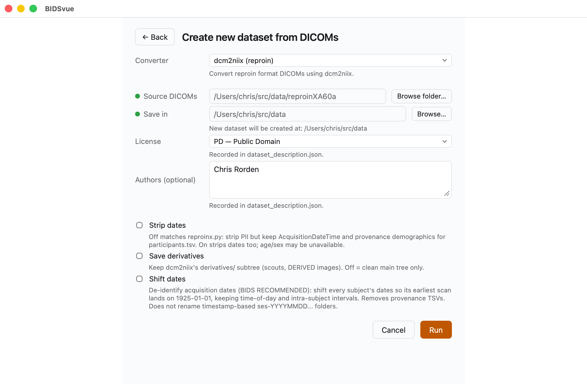
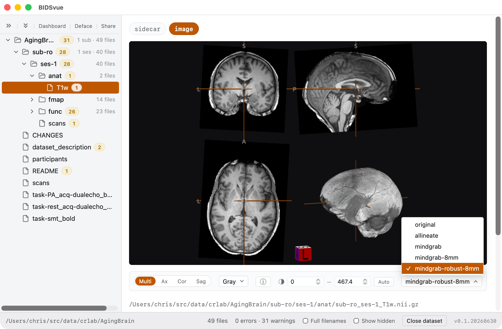
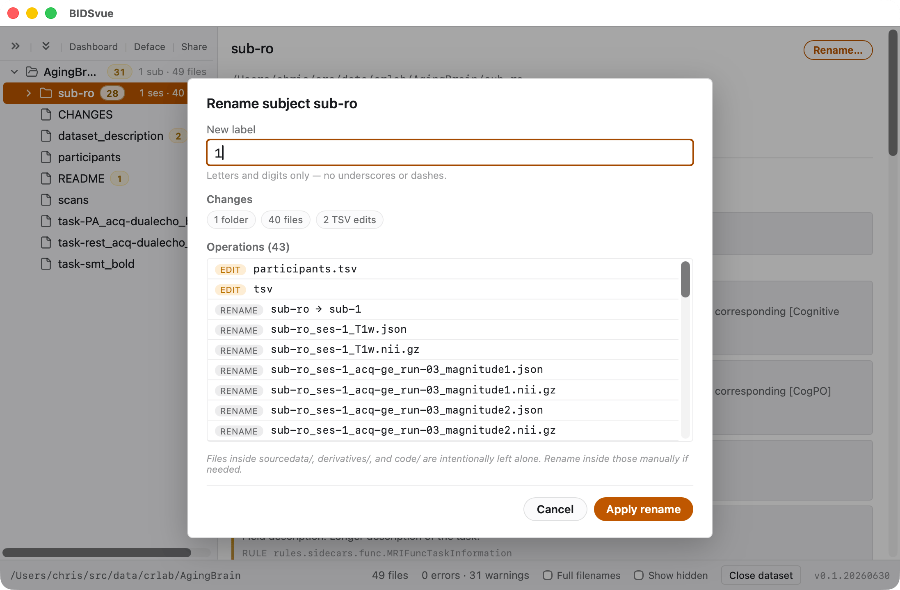
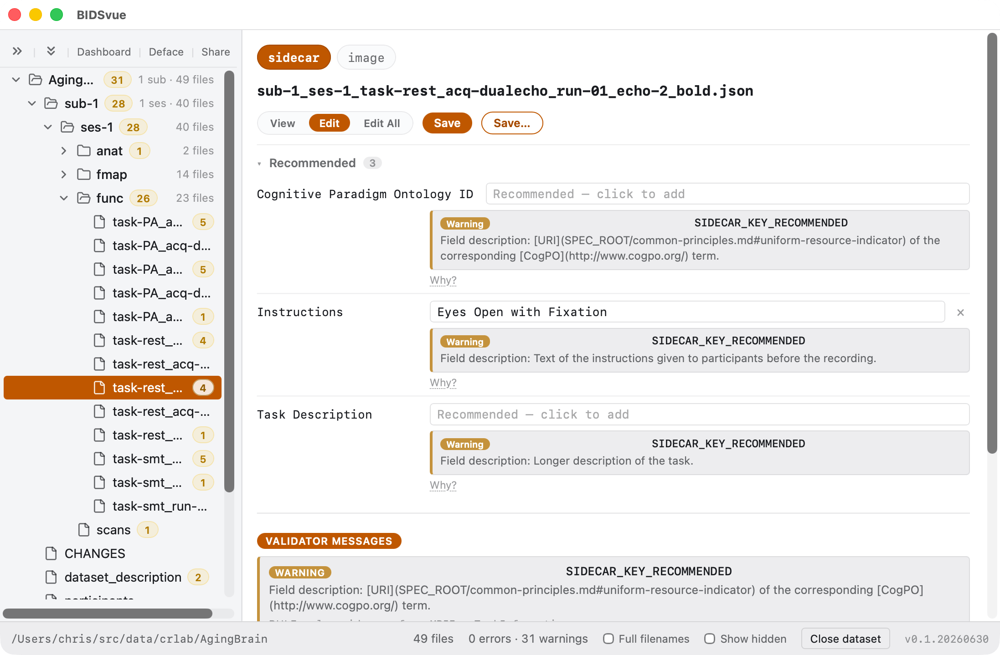
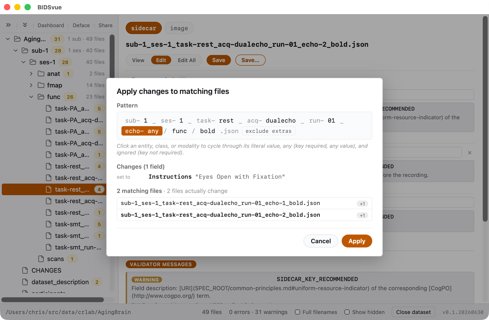
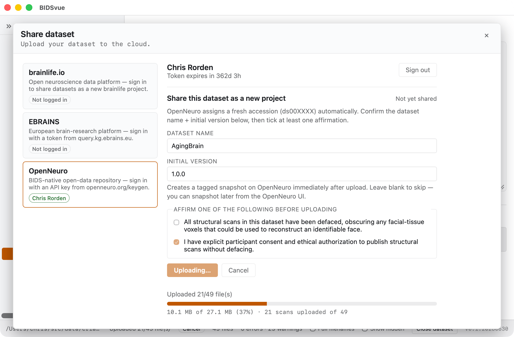

# Convert ReproIn MRI to BIDS

This walkthrough takes a folder of ReproIn-named DICOMs and turns it into a
validated, de-identified, shareable BIDS dataset — converting the images,
checking them against the validator, defacing and renaming to remove
identifiable details, correcting the metadata, and finally publishing to a
public repository. If you name your scans with the
[ReproIn](https://npacore.github.io/reproin-namer/#) convention at acquisition
time, BIDSvue can do most of this for you automatically.

## Requirements

- Install [BIDSvue](https://github.com/niivue/BIDSvue/releases) for Linux, macOS, or Windows.
- Download and extract the sample [`reproinXA60a` dataset](https://osf.io/cqd8j/?action=download) (a single subject, single session).
- Roughly 15 minutes and a little free disk space.

> [!TIP]
> ReproIn encodes the scan's *intent* — task, acquisition, run — directly in
> the series description. That is what lets BIDSvue name 40 files correctly
> without you touching a single one.

## 1. Create a new dataset from DICOM

Launch BIDSvue and choose **Create new dataset from DICOM**, then select the
`dcm2niix (reproin)` converter.

- For **Source DICOMs**, choose the extracted `reproinXA60a` folder.
- For **Save in**, pick a location with enough space and write permission.
- Once both are set the **Run** button lights up. Leave the de-identification
  options at their defaults for now and press **Run**.

## 2. Inspect and de-identify the images

BIDSvue opens straight into the dataset view. The left tree lists every file;
click a node to preview it, and watch the status bar confirm the
bids-validator found no errors.

This is the moment to make sure nothing identifiable survives. Select the
**T1w** image for subject `ro`, session 1, switch from `sidecar` to `image`,
and choose a defacing method — here, `mindgrab-robust-8mm` — to strip facial
features from the anatomical scan.

> [!NOTE]
> The available defacing methods depend on your computer's capabilities, so
> your dropdown may differ slightly from the screenshot.

## 3. Rename subjects and sessions

Personal details sometimes leak into subject or session labels — a name, a
scan date. Right-click the `sub-ro` node, choose **Rename subject sub-ro**, and
set the new label to `1`. BIDSvue rewrites all 40 files to match the BIDS
specification; press **Apply rename** to commit the change.

## 4. Edit the JSON sidecars

Select the `task-rest_acq-dualecho_run-01_echo-2_bold` item and open the
sidecar's **Edit** view. By default it shows only the fields the validator
flagged (`Edit all` reveals every key/value pair). Change **Instructions** to
read `Eyes Open with Fixation`.

- **Save** updates just this sidecar.
- **Save…** lets you apply the same change to related files.

## 5. Apply a change across many files

Choose **Save…** and BIDSvue shows the filename broken into its BIDS
components. Click the parts you want to match to select exactly which files
should receive the edit — one correction, propagated everywhere it belongs.

While you're here, explore the rest of the tree: you can edit sidecars,
tabular files like `participants.tsv`, and plain-text files like the `README`
the same way.

## 6. Share your dataset

Once you're satisfied the data is anonymized and correctly curated, publish it.
Press **Share** above the tree and pick a provider — here, OpenNeuro.

- The first time you share with a repository, you'll be asked for an access
  token; the link provided walks you to it, and BIDSvue remembers it for you.
- The provider may ask you to confirm the data is de-identified before the
  upload begins. You'll then see your files' progress as they upload.

