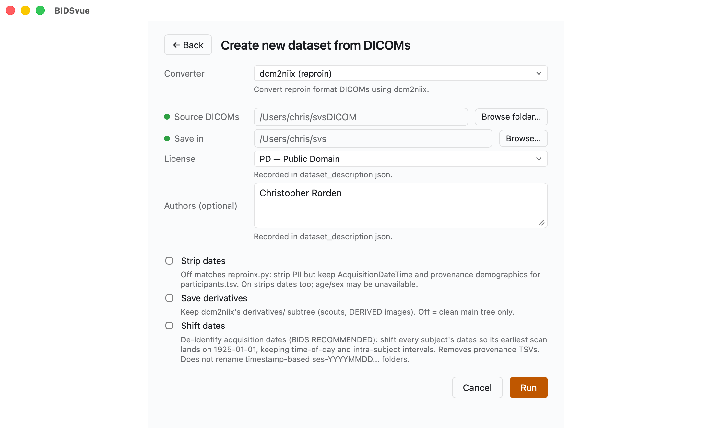
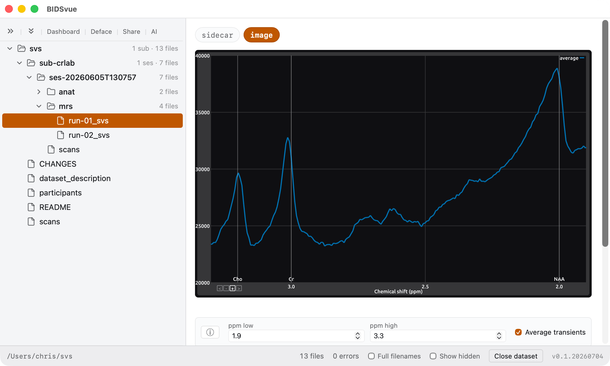

# Convert MRS to BIDS

The BIDS standard supports [Magnetic Resonance Spectroscopy (MRS)](https://bids-specification.readthedocs.io/en/stable/modality-specific-files/magnetic-resonance-spectroscopy.html). This tutorial converts MRS data stored as DICOM into a BIDS dataset, then views the resulting spectrum.

## Requirements

- Install [BIDSvue](https://github.com/niivue/BIDSvue/releases) for Linux, macOS, or Windows.
- Download and extract the sample [`svsDICOM` dataset](https://osf.io/3z98c/?action=download) (a single subject, single session).
- Roughly 15 minutes and a little free disk space.

> [!TIP]
> BIDSvue's built-in dcm2niix can only convert MRS data that's stored as DICOM. If your scanner saves data in a [proprietary format](https://github.com/wtclarke/spec2nii#currently-supported-formats), use [spec2nii](https://github.com/wtclarke/spec2nii) instead.

## 1. Create a new dataset from MRS

Launch BIDSvue and choose **Create new dataset from DICOM**, then select the `dcm2niix (reproin)` converter.

- For **Source DICOMs**, choose the extracted `svsDICOM` folder.
- For **Save in**, pick a location with enough space and write permission.
- Adjust the optional items if you like.
- Press **Run** to create your dataset.

## 2. View the MRS spectrum

BIDSvue opens into the dataset view. The left tree lists every file; click a node to preview it, and watch the status bar confirm the bids-validator found no errors (though several warnings are reported).

Now inspect one of the MRS files. For example, `run-01_svs` offers an `image` view that plots signal intensity against the chemical shift — measured in parts per million (ppm) along the x-axis. Each metabolite appears as a distinct peak or multiplet at a specific ppm, set by its chemical environment.

- Choose between the averaged signal and a separate trace for each individual signal.
- Adjust the graph's range to focus on specific metabolites.

