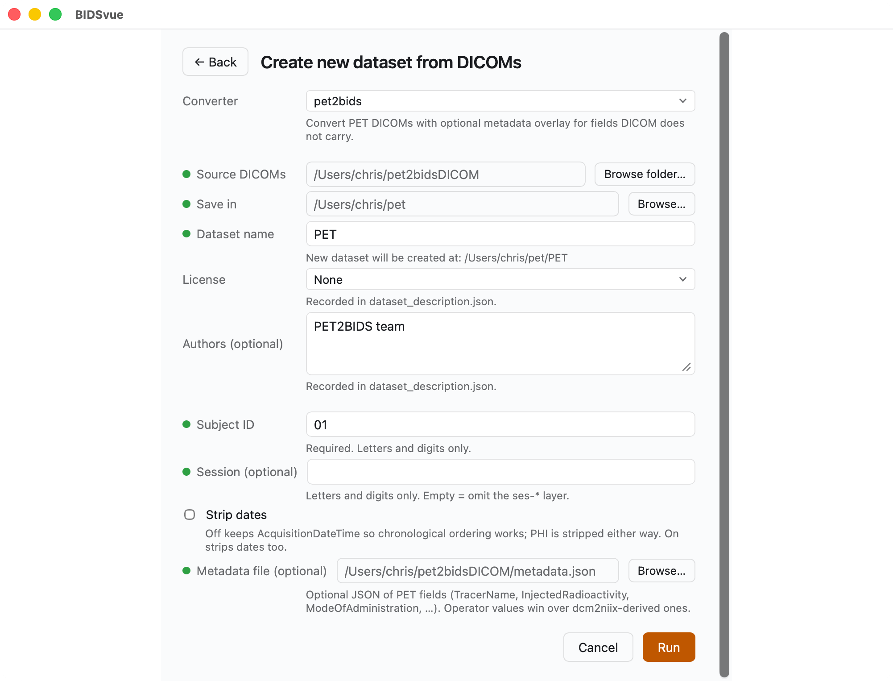
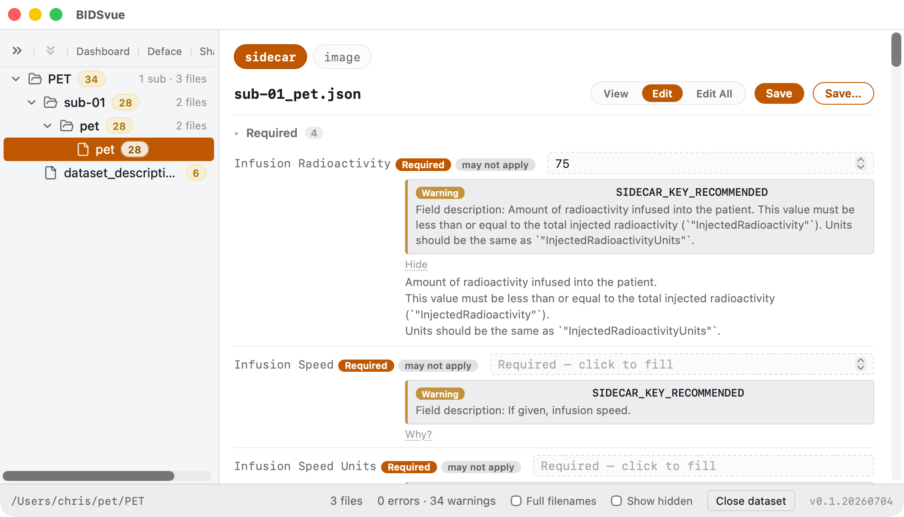
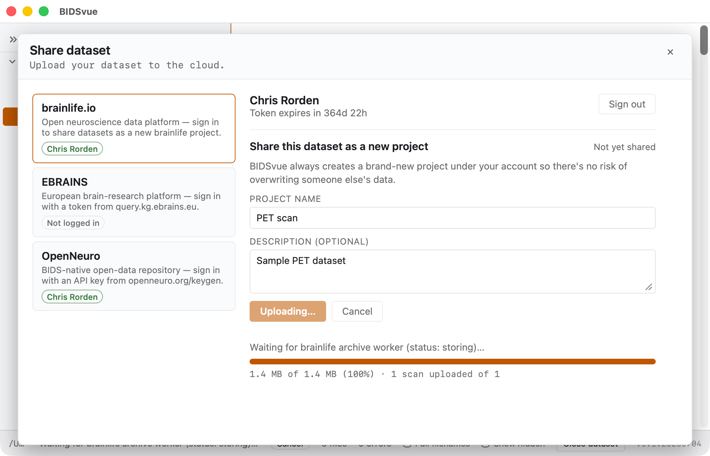

# Convert PET to BIDS

This walkthrough takes a folder of Positron Emission Tomography (PET) DICOMs and turns it into a validated, shareable BIDS dataset using [PET2BIDS](https://github.com/openneuropet/PET2BIDS). Unlike most MRI scans, a PET DICOM doesn't carry every detail needed to analyze the data — in particular, the scanner has no record of which tracer was used, so you supply that separately.

## Requirements

- Install [BIDSvue](https://github.com/niivue/BIDSvue/releases) for Linux, macOS, or Windows.
- Download and extract the sample [`pet2bidsDICOM` dataset](https://osf.io/2vrbc/?action=download) (a single subject, single session).
- Roughly 15 minutes and a little free disk space.

> [!TIP]
> PET2BIDS can read an external metadata file describing the tracer. Without one, you'll need to edit the image sidecars by hand before the dataset will validate.

## 1. Create a new dataset from PET

Launch BIDSvue and choose **Create new dataset from DICOM**, then select the `pet2bids` converter.

- For **Source DICOMs**, choose the extracted `pet2bidsDICOM` folder.
- For **Save in**, pick a location with enough space and write permission.
- Fill out every item with a red marker before the **Run** button becomes enabled.
- Since we have the tracer information, include the provided `metadata.json` as the (optional) metadata file.
- Press **Run** to create your dataset.

## 2. Inspect the dataset

BIDSvue opens into the dataset view. The left tree lists every file; click a node to preview it, and watch the status bar confirm the bids-validator found no errors (though several warnings are reported).

Now check that the scanning details are complete. Select the **pet** image for subject `01` and open its `sidecar`. There are three ways to view it:

- **View** shows every key/value pair in a plain-text editor.
- **Edit** shows only the items the bids-validator flagged.
- **Edit All** opens a structured editor for every tag.

Once you make a change, **Save** updates just this sidecar, or **Save…** applies it to similar files.

## 3. Share your dataset

Once you're satisfied the data is anonymized and correctly curated, publish it. Press **Share** above the tree and pick a provider — here, brainlife.

- The first time you share with a repository, you'll be asked for an access token; the link provided walks you to it, and BIDSvue remembers it for you.
- The provider may ask you to confirm the data is de-identified before the upload begins. You'll then see your files' progress as they upload.

